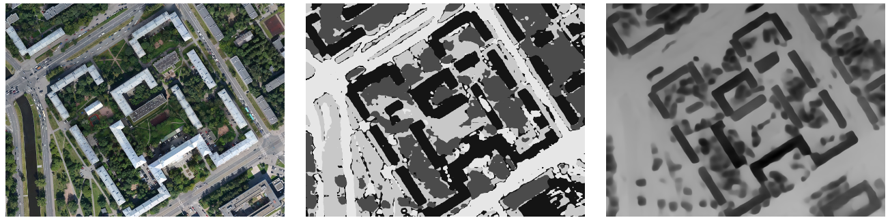
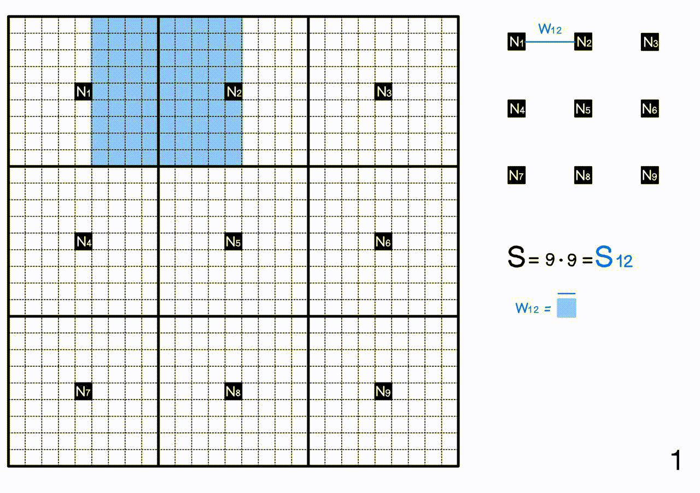
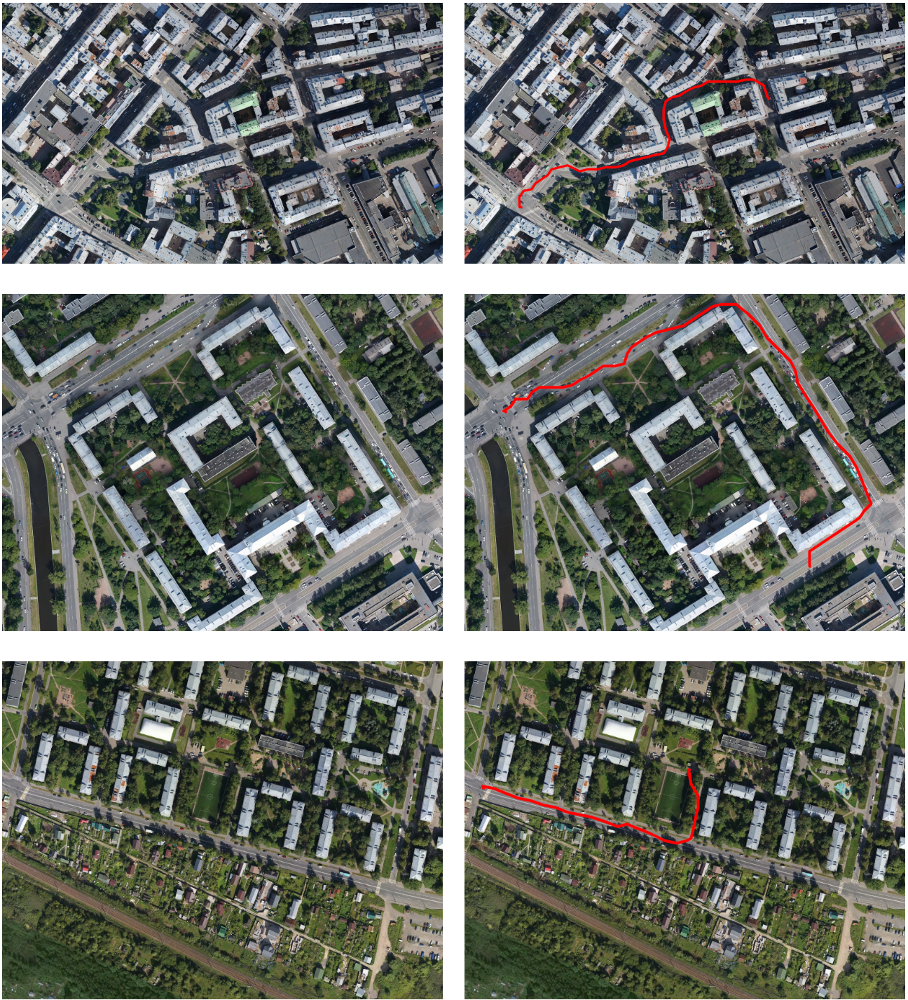

# Search for the optimal flight route for a drone based on the analysis of aerial photos

The full algorithm in Google Colab. The script demonstrates the operation of the algorithm and the graphical interface.

Route search is performed by the method of double frame estimation-evaluation of the depth map obtained from the DepthAnything algorithm and the segmentation map obtained using the SegFormer semantic segmentation model. The route is determined based on a weighted graph that is created from the probability of the flight map. This map is obtained from depth and segmentation maps using the Dijkstra algorithm.

Example of how algorithms work. on the left — the original image, in the center-the result of SegFormer, on the right-the result of DepthAnything:

Based on the segmentation map and the depth map, we create a map of the probability of flight. The map is divided into squares with a side of 9 pixels. The center of each square becomes a node, and the node is named according to the pixel coordinate.
The weight of each edge in the graph is set as the average value of pixels in the square between the corresponding nodes. This is done to make the weights of diagonal edges comparable to the weights of vertical and horizontal edges.
Dijkstra's algorithm is used to find the optimal route. The algorithm is used because the lower the weight of an edge is, the higher the probability of a flight path passing through that edge.
After getting the route, it is interpolated and the number of points is reduced by 4 times. The nodes are named according to the coordinates of the corresponding pixels, so the flight path can be represented as a function of the form y(x). However, the values of x can be repeated, making interpolation impossible. Therefore, I parameterize it as x(t) and y(t), where t represents an increasing variable, in this case, the index in the array.

Building a graph based on an image:

Example of setting a flight route. on the left — the original image, on the right-the image with the route laid out:

